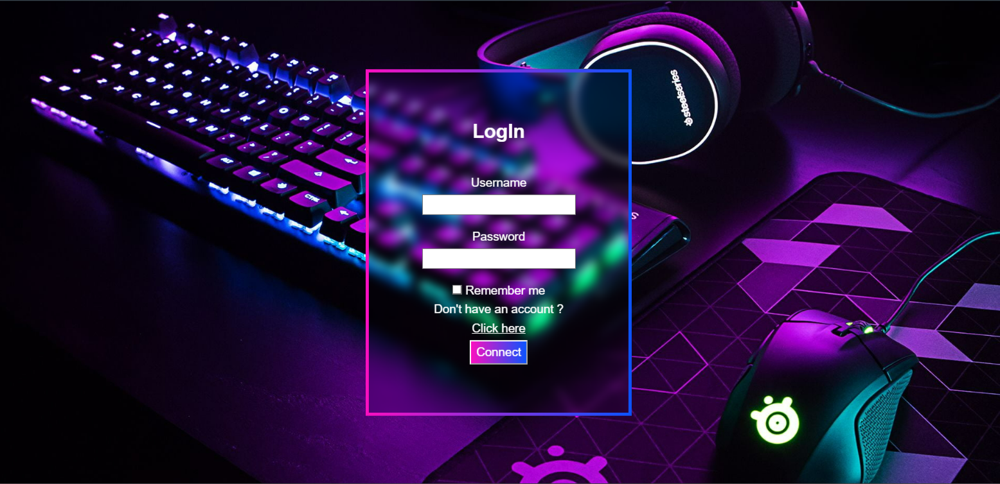
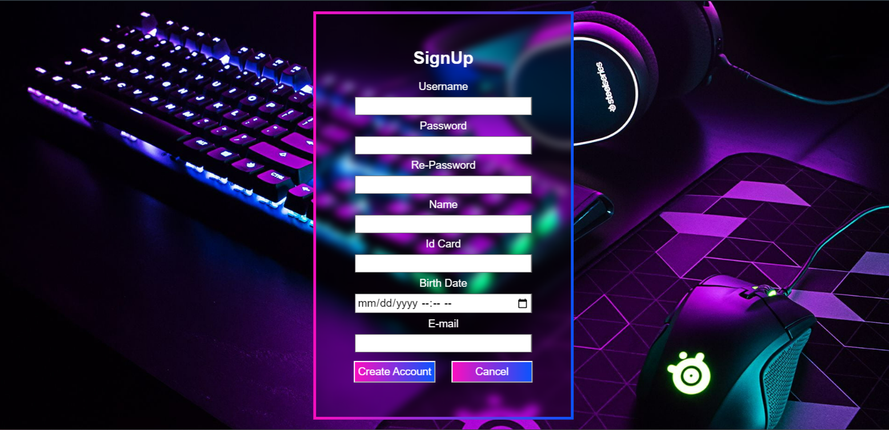
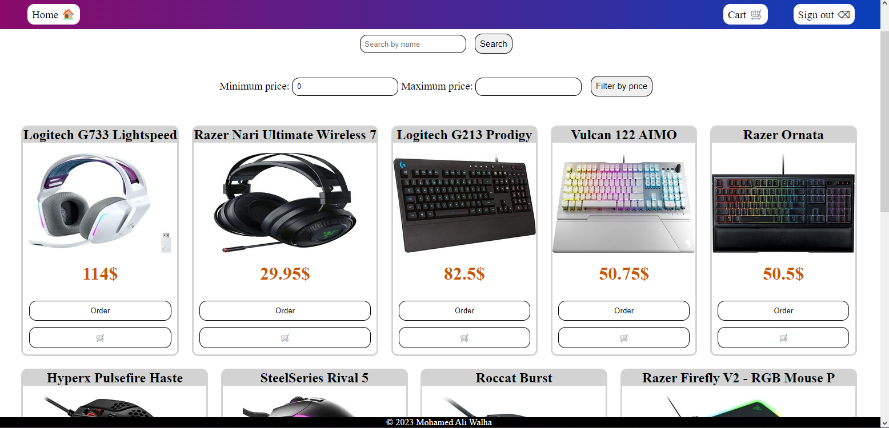
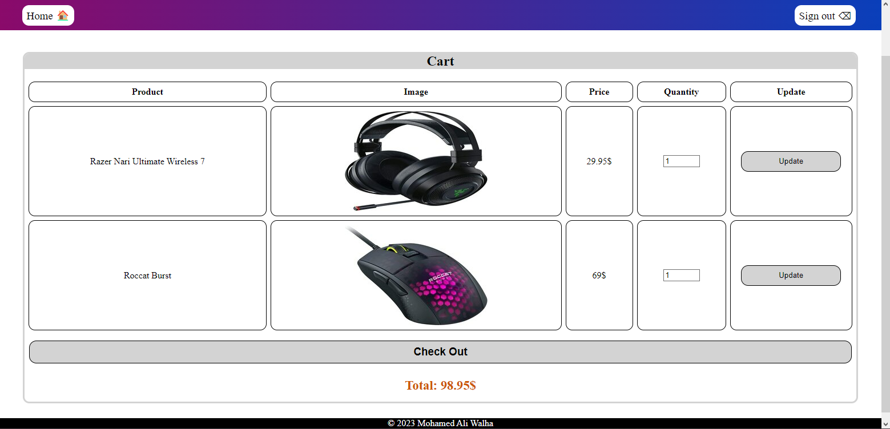
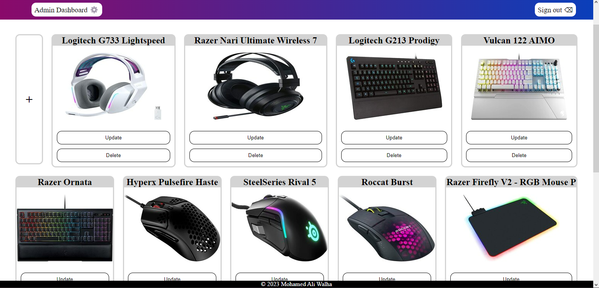

# Product Listing Site - A University project

This Project is a web app that allows users to view, order, and manage products. Built with HTML, CSS, JavaScript, PHP, and MySQL using the MVC architecture, this app provides an easy-to-use interface for both customers and admins.

## Features

- Product listing: Users can view a list of available products with their names and prices.
- Product details: Users can click on a product to view its detailed description, including its designation, brand, color, and image.
- Product ordering: Users can order a product if its quantity in the database is greater than 0. They can add multiple products to their cart, which will stay saved even if they log out. They can also order all products in the shopping cart.
- Product filtering: Users can filter products on the home page by name or by price.
- Admin authentication: Admin users can authenticate themselves to access the admin dashboard.
- Product management: Admin users can add, delete, and update products in the database, including their ID, designation, description, brand, color, quantity, price, and image.

## Screenshots











## Run Locally

Clone the project

```bash
  git clone https://github.com/M3dnux/Product-Listing-Site.git
```
## SQL Script

```bash
  CREATE DATABASE php_project_db;
  
  CREATE TABLE tUser (
    login VARCHAR(15),
    password VARCHAR(20) NOT NULL,
    name VARCHAR(30) NOT NULL,
    id_card INT(8) NOT NULL,
    birth_date DATE NOT NULL,
    email VARCHAR(40) NOT NULL,
    type INT(1) NOT NULL
    ,CONSTRAINT PK_tUser PRIMARY KEY(login)  
  );

  CREATE TABLE tProduct (
    id VARCHAR(12),
    designation VARCHAR(30) NOT NULL,
    description VARCHAR(200) NOT NULL,
    brand VARCHAR(15) NOT NULL,
    color VARCHAR(15) NOT NULL,
    quantity INT NOT NULL,
    price FLOAT NOT NULL
    ,CONSTRAINT PK_tProduct PRIMARY KEY(id)
  );

  CREATE TABLE tcart (
    user_id VARCHAR(15),
    product_id VARCHAR(12) NOT NULL,
    designation VARCHAR(30) NOT NULL,
    quantity INT NOT NULL,
    price FLOAT NOT NULL
    ,CONSTRAINT PK_tcart PRIMARY KEY (user_id, product_id)
    ,CONSTRAINT FK_tcart_tUser FOREIGN KEY (user_id) REFERENCES tUser(login)
    ,CONSTRAINT FK_tcart_tProduct FOREIGN KEY (product_id) REFERENCES tProduct(id)
  );
  
  INSERT INTO tProduct VALUES("PGMO0001", "Hyperx Pulsefire Haste", "The HyperX Pulsefire Haste is built for elite gamers looking to gain every fraction of a second possible in their quest to be the best.", "Hyperx", "Black", 4, 400);

  INSERT INTO tProduct VALUES("PGHS0001", "JBL Quantum 400", "The JBL Quantum 400, like other headsets in JBL's Quantum lineup, is marketed as giving gamers a competitive advantage with its spatial sound capabilities and sound quality.", "JBL", "Black", 17, 107.50);

  INSERT INTO tProduct VALUES("PGKE0001", "Logitech G213 Prodigy", "The G213 gaming keyboard features Logitech G Mech-Dome keys that are specially tuned to deliver a superior tactile response and overall performance profile similar to a mechanical keyboard.", "Logitech", "Black", 17, 82.50);

  INSERT INTO tProduct VALUES("PGMO0002", "SteelSeries Rival 5", "The SteelSeries Rival 5 is a versatile wired gaming mouse. It's somewhat lightweight, feels sturdy, and has an ergonomic right-handed shape ideal for all grip types.", "SteelSeries", "Black", 17, 97.50);

  INSERT INTO tProduct VALUES("PGHS0002", "Logitech G733 Lightspeed", "Logitech has put some great gaming headsets out over the years, but a lot of the company’s more colorful plastic headsets have been in need of an update for a long time.", "Logitech", "White", 17, 114);

  INSERT INTO tProduct VALUES("PGMP0001", "Razer Firefly V2 - RGB Mouse Pad", "An ultra thin mouse pad featuring RGB lighting effects, and a micro-textured surface with a built-in cable catch for smoother mouse swipes.", "Razer", "Black", 17, 312);

  INSERT INTO tProduct VALUES("PGKE0002", "Vulcan 122 AIMO", "The Vulcan is the first keyboard to feature ROCCAT-developed Titan Switches. The switches, designed from the ground up, were built for gamers.", "Roccat", "White", 17, 50.75);

  INSERT INTO tProduct VALUES("PGHS0003", "Razer Nari Ultimate Wireless 71", "Introducing the Razer Nari Ultimate, featuring Razer HyperSense — a wireless PC gaming headset equipped with intelligent haptic technology developed by Lofelt™.", "Razer", "Black", 17, 29.95);

  INSERT INTO tProduct VALUES("PGKE0003", "Razer Ornata", "Experience the best of both worlds with the Razer Ornata V2—featuring a hybrid switch that merges the benefits of membrane keys and mechanical switches into one singular design." ,"Razer", "Black", 17, 50.50);

  INSERT INTO tProduct VALUES("PGMO0003", "Roccat Burst", "Meet the ROCCAT® Burst Pro Extreme Lightweight Optical Pro Gaming Mouse. Engineered from scratch with a symmetrical ergonomic shape that feels better than other mice from the very first touch.", "Roccat", "Black", 17, 69);

  INSERT INTO tProduct VALUES("PGMP0002", "Razer Sphex V2 Mini Gaming Mouse Pad", "Designed to give gamers a seamless desktop experience, the Razer Sphex V2 is the ultra-thin gaming mat which delivers high tracking quality for both laser and optical gaming mice.", "Razer", "Black", 17, 102.75);

  INSERT INTO tProduct VALUES("PGMP0003", "SteelSeries QCK Gaming Surface", "The QcK gaming mouse pad has been used by gamers to win more tournaments than any other mousepad in the world.-Precision Surface-Durable, super-soft cloth surface, a smooth and consistent glide.", "SteelSeries", "Black", 17, 99.99);

  INSERT INTO tUser VALUES("admin", "admin", "Saleh Ben Mousa", 11147825, 2000-5-1, "saleh115az@gmail.com", 0);
  INSERT INTO tUser VALUES("M3dnux", "M3dnux", "Mohamed Ali Walha", 11145879, 2000-8-25, "mohamed2000az@gmail.com", 1);
```

## Feedback

If you have any feedback or issues, please reach out to me at walha_med.ali@outlook.fr.
